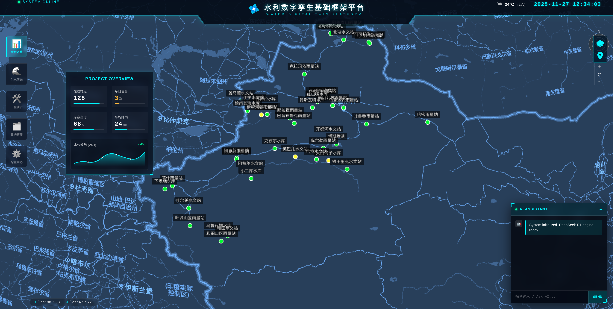

# 水利数字孪生系统演示

基于 Vue 3 + TypeScript + Cesium 的水利数字孪生可视化平台演示项目。

> **声明**：本项目所有数据均为模拟数据，仅供技术演示和学习参考，不代表任何真实情况。

## 预览



## 技术栈

- **前端框架**：Vue 3 + TypeScript + Vite
- **3D 引擎**：Cesium 1.82 (epawse 定制版，支持底图滤镜)
- **UI 组件**：Element Plus
- **样式**：SCSS + 科幻风格 UI

## 功能模块

### 1. 首页 (Dashboard)
- 水情态势总览
- 站点分布地图
- 实时数据统计卡片

### 2. 数字孪生
- 三维场景可视化
- 洪水淹没模拟演示
- 时间轴播放控制

### 3. 工程演示
- BIM/3D Tiles 模型加载
- 工程设施展示

### 4. 数据管理
- 监测站点管理（水库、水文、雨量）
- 洪水事件配置
- IoT 设备状态
- 三维资源清单

## 模拟数据说明

本项目包含以下模拟数据，**均为虚构，仅供演示**：

| 数据类型 | 说明 |
|---------|------|
| 监测站点 | 模拟的水库站、水文站、雨量站 |
| 洪水事件 | 虚构的洪水场景配置 |
| IoT 设备 | 模拟的遥测终端、闸门控制器等 |
| 预警规则 | 示例预警阈值配置 |
| 模型结果 | 模拟的水动力模型计算结果 |
| AI 知识库 | 示例工具和知识条目 |

## 快速开始

```bash
# 安装依赖
npm install

# 开发模式
npm run dev

# 构建生产版本
npm run build
```

## 底图配置

项目使用天地图作为底图服务，需要在 `.env` 中配置：

```env
VITE_APP_NAME = '水利数字孪生系统'
VITE_API_URL = '/api'
VITE_API_ASSETS = '/'
```

## 项目结构

```
src/
├── components/        # 公共组件
├── mock/             # 模拟数据
│   ├── simData.ts        # 站点、事件、设备数据
│   ├── alertRules.ts     # 预警规则
│   ├── modelResults.ts   # 模型结果
│   └── aiKnowledge.ts    # AI 知识库
├── utils/            # 工具函数
│   └── ctrlCesium/       # Cesium 控制器
├── views/            # 页面视图
│   ├── Dashboard.vue     # 首页
│   ├── DigitalTwin/      # 数字孪生
│   ├── EngineeringDemo.vue # 工程演示
│   └── DataManagement.vue  # 数据管理
└── router/           # 路由配置
```

## 许可证

MIT License
